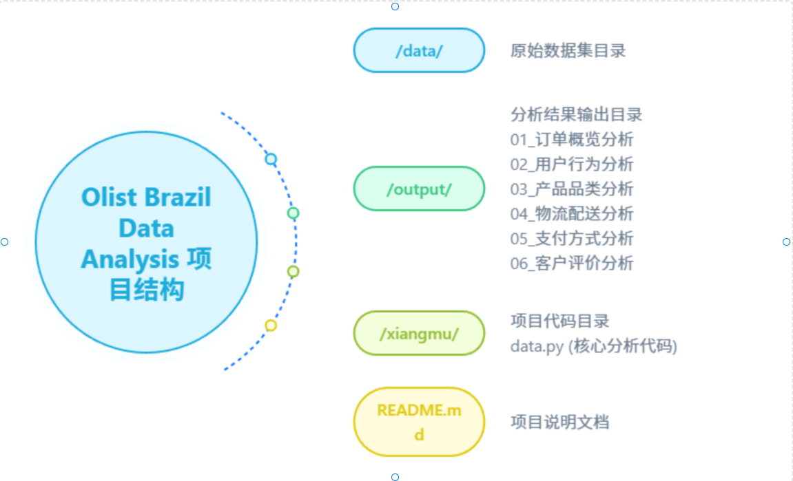

# 巴西Olist电商平台数据分析项目

## 项目概述

本项目针对巴西 Olist 电商平台的公开数据集进行全面的数据分析，涵盖订单概览、用户行为、产品品类、物流配送、支付方式、客户评价六大核心模块，旨在挖掘电商平台运营的关键洞察，为业务决策提供数据支撑。

## 项目结构

```Plain Text




```

## 环境依赖

```Plain Text
python >= 3.7
pandas >= 1.3.0
numpy >= 1.21.0
matplotlib >= 3.4.0
seaborn >= 0.11.0
```

安装依赖：

```bash
pip install pandas numpy matplotlib seaborn
```

## 数据集说明

项目使用 Olist 电商平台的公开数据集，包含以下 9 个核心文件：

- `olist\_orders\_dataset\.csv`: 订单主数据

- `olist\_order\_items\_dataset\.csv`: 订单项数据

- `olist\_order\_payments\_dataset\.csv`: 支付信息数据

- `olist\_order\_reviews\_dataset\.csv`: 客户评价数据

- `olist\_products\_dataset\.csv`: 产品信息数据

- `olist\_sellers\_dataset\.csv`: 卖家信息数据

- `olist\_customers\_dataset\.csv`: 客户信息数据

- `olist\_geolocation\_dataset\.csv`: 地理信息数据

- `product\_category\_name\_translation\.csv`: 产品品类翻译数据

## 核心功能

### 1\. 数据预处理模块

- 自动扫描系统中文字体，解决 Matplotlib 中文显示乱码问题

- 批量读取数据集并进行格式校验

- 日期格式标准化转换

- 关键指标计算（配送时间、配送延迟等）

- 数据合并与清洗

### 2\. 六大分析模块

#### 【模块 1】订单概览分析

- 订单时间趋势分析（月度订单量变化）

- 订单金额分布分析（平均值、中位数、极值）

- 订单状态分布分析（配送完成率、取消率）

- 订单地理分布分析（各州订单量 TOP10）

#### 【模块 2】用户行为分析

- 用户购买频次分析（一次性购买 vs 多次购买）

- 复购率计算与分析

- 用户下单时间分布（小时维度、星期维度）

- 高价值用户识别

#### 【模块 3】产品品类分析

- 品类销量 TOP10 分析

- 品类销售额 TOP10 分析

- 品类平均单价分析

- 产品销量分布（长尾效应分析）

#### 【模块 4】物流配送分析

- 配送时间分布分析（平均配送时长、极值）

- 配送延迟分析（延迟率、严重延迟率）

- 月度配送时效趋势

- 各州配送时效对比

#### 【模块 5】支付方式分析

- 支付方式分布占比

- 不同支付方式的金额分布

- 分期付款行为分析

#### 【模块 6】客户评价分析

- 评价星级分布

- 评价时间趋势

- 差评原因分析

- 评价与配送时效相关性分析

## 运行说明

1. 将原始数据集放入`data`目录

2. 修改代码中`data\_path`和`base\_output\_path`为实际路径

3. 运行分析代码：

```bash
python data.py
```

4. 分析结果将自动保存至`output`目录下对应模块文件夹，包含可视化图表和关键指标输出

## 可视化输出

每个分析模块均生成对应的可视化图表：

- 折线图：趋势类分析（如月度订单量、配送时效趋势）

- 柱状图：排名类分析（如 TOP10 品类、各州订单量）

- 饼图：占比类分析（如订单状态、支付方式）

- 直方图：分布类分析（如订单金额、配送时间）

所有图表均支持中文显示，分辨率为 300DPI，保证高清输出。

## 关键技术亮点

1. **中文显示优化**：自动扫描系统中文字体，解决 Matplotlib 中文乱码问题

2. **模块化设计**：六大分析模块独立封装，便于扩展和维护

3. **数据质量校验**：自动检测数据读取异常，保证分析稳定性

4. **可视化优化**：标签防重叠、颜色搭配、布局自适应等细节优化

5. **自动化输出**：自动创建分析目录，结果文件分类存储

## 项目扩展建议

1. 增加机器学习模块，预测客户复购率、配送延迟风险

2. 接入地理信息可视化，实现订单分布的地图展示

3. 增加时间序列分析，预测未来订单量趋势

4. 构建交互式分析仪表板（如使用 Streamlit/Dash）

5. 增加 A/B 测试分析模块，评估不同营销策略效果

## 数据来源

Olist 电商平台公开数据集：[https://www\.kaggle\.com/datasets/olistbr/brazilian\-ecommerce](https://www.kaggle.com/datasets/olistbr/brazilian-ecommerce)

## 注意事项

1. 确保数据集路径配置正确，否则会导致数据读取失败

2. 首次运行时会自动创建输出目录，需保证有目录写入权限

3. 处理大规模数据时建议增加内存配置，避免内存溢出

4. 不同操作系统的字体路径可能存在差异，若中文显示异常可手动指定字体路径


> 注：本文档部分内容由AI辅助生成，已人工审核修改。
